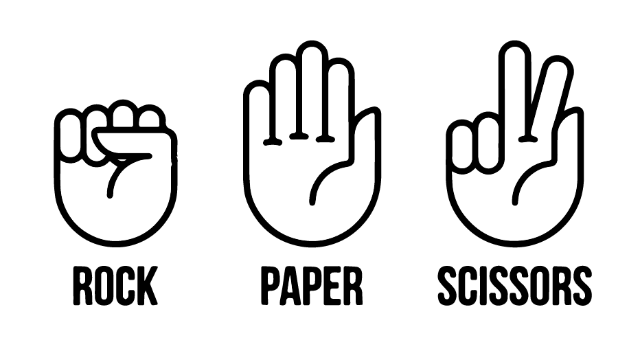
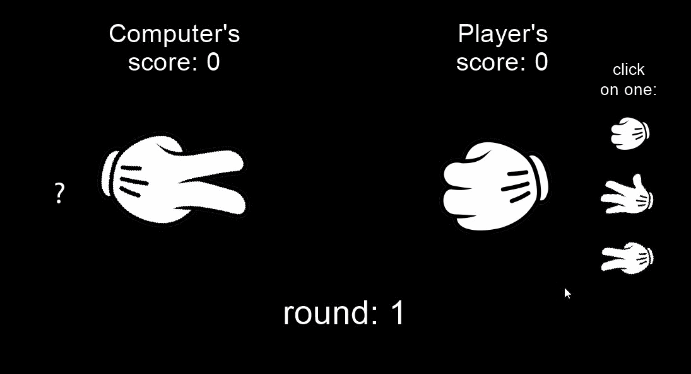

# Rock paper scissors game
This is a basic python code of rock/paper/scissors game. There are 3 rounds and the one with higher score wins. If you want to play the game with pyglet library, **open rockpaperscissors with graphics file**, otherwise the rockpaperscissors.py is opened in the command line.

## Game preview

## Motivation
For my training I have created an easy game Rock/paper/scissors to tighten the basics of python programming.

## Instalation

#### Setup
install python pyglet library
>$ pip install pyglet

#### Clone
Clone the repository by using the link
> https://github.com/alexkim3/Rock-paper-scissor-game.git
